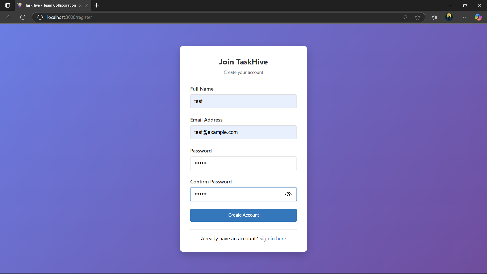
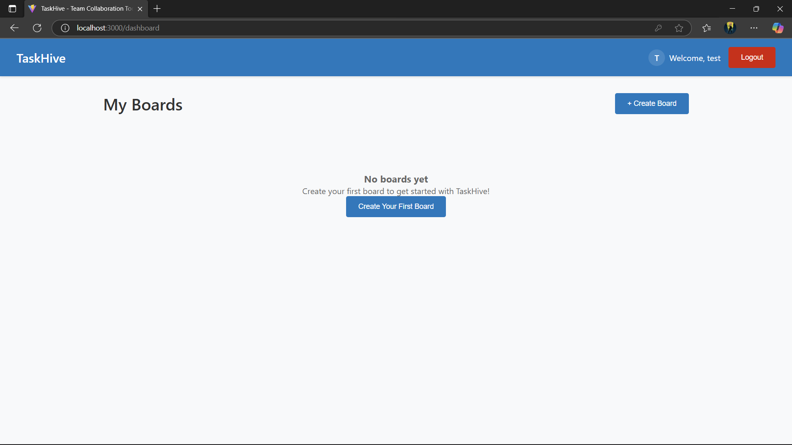
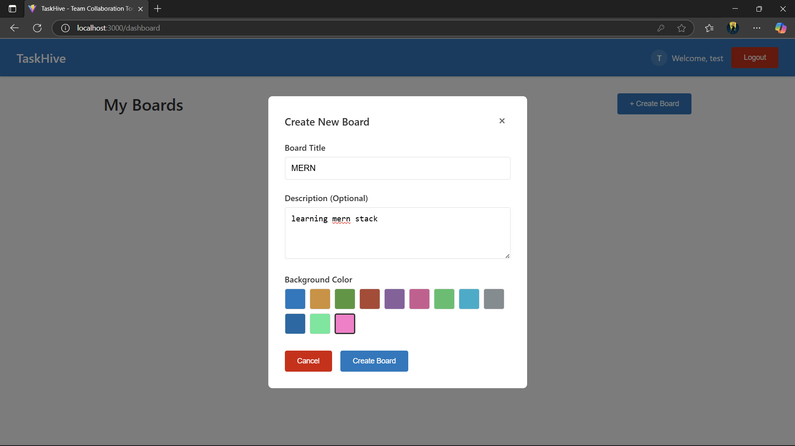
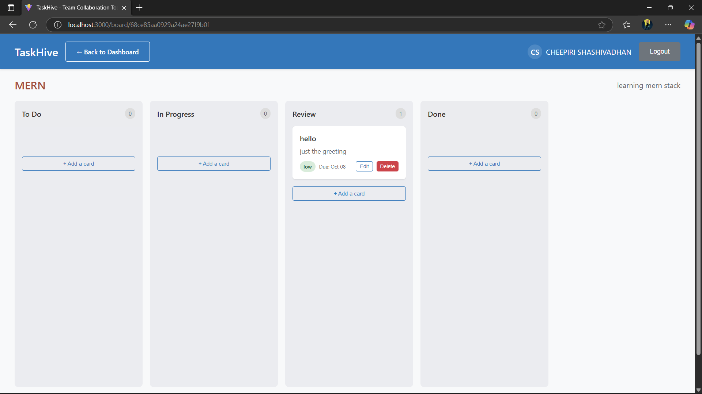
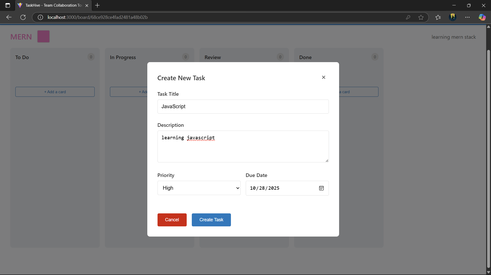
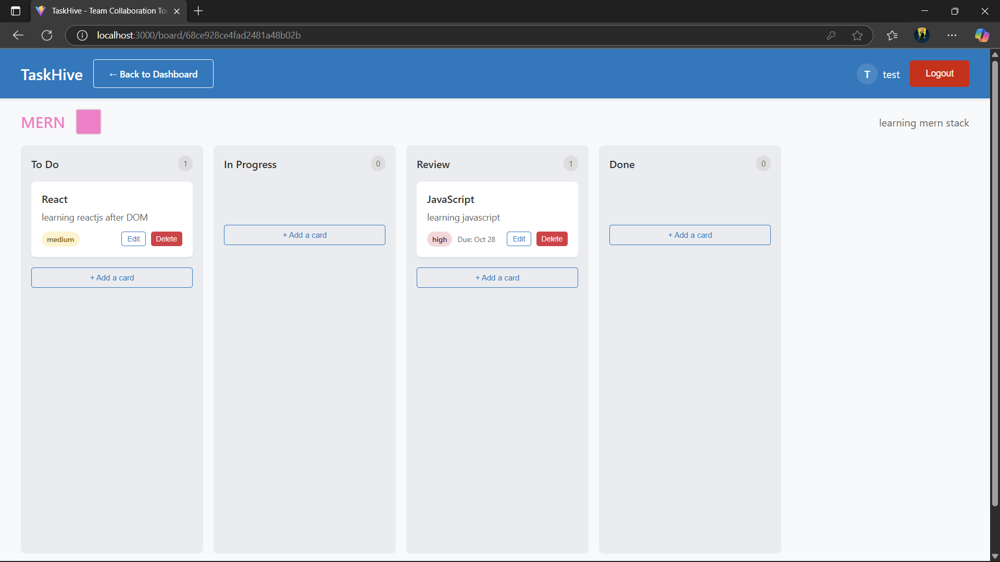

# TaskHive 🐝

<div align="center">
  
  
  
  
  
</div>

<div align="center">
  <h3>🚀 Modern Task Management Platform</h3>
  <p><em>Streamline your workflow with intuitive project organization and real-time collaboration</em></p>
</div>

---

## 📖 Overview

TaskHive is a comprehensive, full-stack task management application engineered with the MERN stack. Designed for modern teams and individuals, it combines powerful functionality with an intuitive user experience to enhance productivity and streamline project workflows.

### ✨ Key Highlights

🔐 **Enterprise-Grade Security** - JWT authentication with bcrypt encryption  
🎯 **Kanban-Style Boards** - Visual project organization with drag-and-drop  
⚡ **Real-Time Collaboration** - Live updates and team synchronization  
📱 **Responsive Design** - Optimized for desktop, tablet, and mobile  
🛡️ **API Protection** - Rate limiting and comprehensive input validation

---

## 🏗️ Technical Architecture

<div align="center">
  
| **Layer** | **Technology** | **Purpose** |
|-----------|----------------|-------------|
| Frontend | React + Vite | Modern UI with fast development |
| Backend | Node.js + Express | RESTful API server |
| Database | MongoDB + Mongoose | Document-based data storage |
| Security | JWT + bcryptjs | Authentication & authorization |
| DevOps | CORS + Helmet | Security middleware |

</div>

### 🔧 Technology Stack

#### Backend Infrastructure
```
🟢 Node.js              Runtime environment
🚀 Express.js           Web application framework
🍃 MongoDB              NoSQL database solution
📊 Mongoose             MongoDB object modeling
🔑 JWT                  Token-based authentication
🔒 bcryptjs             Password hashing
🛡️ Helmet               Security headers
📝 Morgan               HTTP request logging
⚡ express-rate-limit   API rate limiting
```

#### Frontend Technologies
```
⚛️ React                Component-based UI library
⚡ Vite                 Next-generation build tool
🛣️ React Router         Client-side routing
📡 Axios                HTTP client library
🎯 @hello-pangea/dnd    Drag & drop functionality
📅 date-fns             Date manipulation utilities
```

---

## 🎯 Core Features

### 👤 User Management
- **Secure Authentication** - Robust login/registration system
- **Profile Management** - User preferences and settings
- **Session Management** - JWT-based secure sessions

### 📋 Task Operations
- **CRUD Operations** - Create, read, update, delete tasks
- **Priority Levels** - Organize by importance and urgency  
- **Status Tracking** - Monitor progress across workflows
- **Due Date Management** - Timeline and deadline tracking

### 📊 Board System
- **Kanban Boards** - Visual workflow management
- **Custom Columns** - Tailored project stages
- **Drag & Drop** - Intuitive task reorganization
- **Board Templates** - Quick project setup

### 💬 Collaboration Tools
- **Task Comments** - Threaded discussions
- **Team Sharing** - Multi-user board access
- **Activity Feeds** - Real-time project updates
- **Notification System** - Stay informed of changes

---

## 🖼️ Screenshots

<div align="center">
  
   
</div>
<div align="center">
  
   
  
</div>
<div align="center">
  
  
</div>


## 🚀 Quick Start Guide

### Prerequisites

Ensure you have the following installed:
- **Node.js** v16.0.0 or higher
- **MongoDB** 4.4+ (local or Atlas)
- **npm** or **yarn** package manager

### Installation Steps

#### 1️⃣ Repository Setup
```bash
git clone https://github.com/your-username/taskhive.git
cd taskhive
```

#### 2️⃣ Backend Configuration
```bash
cd taskhive_backend
npm install
```

Create your environment configuration:
```bash
# .env file
PORT=5000
MONGODB_URI=mongodb://localhost:27017/taskhive
JWT_SECRET=your-256-bit-secret-key
NODE_ENV=development
CORS_ORIGIN=http://localhost:5173
```

#### 3️⃣ Frontend Setup
```bash
cd ../taskhive_frontend
npm install
```

#### 4️⃣ Launch Application
```bash
# Terminal 1 - Backend Server
cd taskhive_backend
npm run dev

# Terminal 2 - Frontend Server
cd taskhive_frontend
npm run dev
```

### 🌐 Access Points
- **Frontend Application**: http://localhost:5173
- **Backend API**: http://localhost:5000
- **API Health Check**: http://localhost:5000/api/health

---

## 📚 API Documentation

### 🔐 Authentication Endpoints
```http
POST   /api/auth/register    # User registration
POST   /api/auth/login       # User authentication
GET    /api/auth/profile     # Retrieve user profile
POST   /api/auth/logout      # Session termination
```

### 📊 Board Management
```http
GET    /api/boards           # List all boards
POST   /api/boards           # Create new board
GET    /api/boards/:id       # Retrieve specific board
PUT    /api/boards/:id       # Update board details
DELETE /api/boards/:id       # Remove board
```

### 📝 Task Operations
```http
GET    /api/tasks            # List all tasks
POST   /api/tasks            # Create new task
GET    /api/tasks/:id        # Retrieve specific task
PUT    /api/tasks/:id        # Update task details
DELETE /api/tasks/:id        # Remove task
PATCH  /api/tasks/:id/status # Update task status
```

### 💬 Comment System
```http
GET    /api/comments/:taskId # List task comments
POST   /api/comments/:taskId # Add new comment
PUT    /api/comments/:id     # Update comment
DELETE /api/comments/:id     # Remove comment
```

---

## 📁 Project Structure

```
taskhive/
├── 🗂️ taskhive_backend/
│   ├── 📁 config/           # Database & app configuration
│   ├── 📁 controllers/      # Business logic handlers
│   ├── 📁 middleware/       # Custom middleware functions
│   ├── 📁 models/           # Database schemas
│   ├── 📁 routes/           # API endpoint definitions
│   ├── 📁 utils/            # Helper functions
│   ├── 📄 server.js         # Application entry point
│   └── 📄 package.json      # Backend dependencies
│
├── 🗂️ taskhive_frontend/
│   ├── 📁 public/           # Static assets
│   ├── 📁 src/
│   │   ├── 📁 components/   # Reusable UI components
│   │   ├── 📁 context/      # React context providers
│   │   ├── 📁 hooks/        # Custom React hooks
│   │   ├── 📁 pages/        # Route page components
│   │   ├── 📁 services/     # API communication
│   │   ├── 📁 styles/       # Global styling
│   │   └── 📄 App.jsx       # Root application component
│   ├── 📄 index.html        # HTML template
│   ├── 📄 package.json      # Frontend dependencies
│   └── 📄 vite.config.js    # Build configuration
│
├── 📄 README.md             # Project documentation
└── 📄 .gitignore           # Version control exclusions
```

---

## 🛡️ Security Implementation

### 🔒 Authentication & Authorization
- **JWT Tokens** - Stateless authentication mechanism
- **Password Hashing** - bcryptjs with salt rounds
- **Protected Routes** - Middleware-based authorization
- **Token Expiration** - Automatic session management

### 🛡️ API Security
- **Rate Limiting** - 100 requests per 15-minute window
- **CORS Policy** - Cross-origin request protection
- **Input Validation** - Comprehensive data sanitization
- **Security Headers** - Helmet.js middleware implementation

### 📊 Monitoring & Logging
- **Request Logging** - Morgan HTTP logger
- **Error Handling** - Centralized error management
- **Health Checks** - System status monitoring

---

## 🚀 Development Commands

### Backend Scripts
```bash
npm run dev      # Development server with hot reload
npm start        # Production server
npm run test     # Run test suites
npm run lint     # Code linting
```

### Frontend Scripts
```bash
npm run dev      # Vite development server
npm run build    # Production build
npm run preview  # Preview production build
npm run lint     # ESLint code analysis
```

---

## 🌟 User Experience

### 🎨 Design Principles
- **Minimalist Interface** - Clean, distraction-free design
- **Intuitive Navigation** - Self-explanatory user flows
- **Responsive Layout** - Seamless cross-device experience
- **Accessibility** - WCAG 2.1 compliance standards

### 📱 Mobile Optimization
- **Touch-Friendly** - Optimized for mobile interactions
- **Progressive Web App** - App-like mobile experience
- **Offline Support** - Limited functionality without internet
- **Performance** - Fast loading on mobile networks

---

## 🤝 Contributing

We welcome contributions from the community! Please follow these guidelines:

### 📋 Contribution Process
1. **Fork** the repository
2. **Create** a feature branch (`git checkout -b feature/amazing-feature`)
3. **Commit** changes (`git commit -m 'feat: add amazing feature'`)
4. **Push** to branch (`git push origin feature/amazing-feature`)
5. **Submit** a Pull Request

### 📝 Development Guidelines
- Follow existing code style and conventions
- Write comprehensive tests for new features
- Update documentation for API changes
- Ensure all tests pass before submission

---

## 📞 Support & Community

<div align="center">

### 🆘 Getting Help
- **Documentation**: Comprehensive guides and API reference
- **Issues**: Report bugs or request features on GitHub
- **Discussions**: Community Q&A and general discussion

### 📧 Contact Information
**Email**: support@taskhive.dev  
**GitHub**: [Shashivadhan1911](https://github.com/Shashivadhan1911)  

</div>


<div align="center">
  <h3>🐝 TaskHive - Where Productivity Meets Simplicity</h3>
  <p><em>Built with ❤️ by developers, for developers</em></p>

</div>


